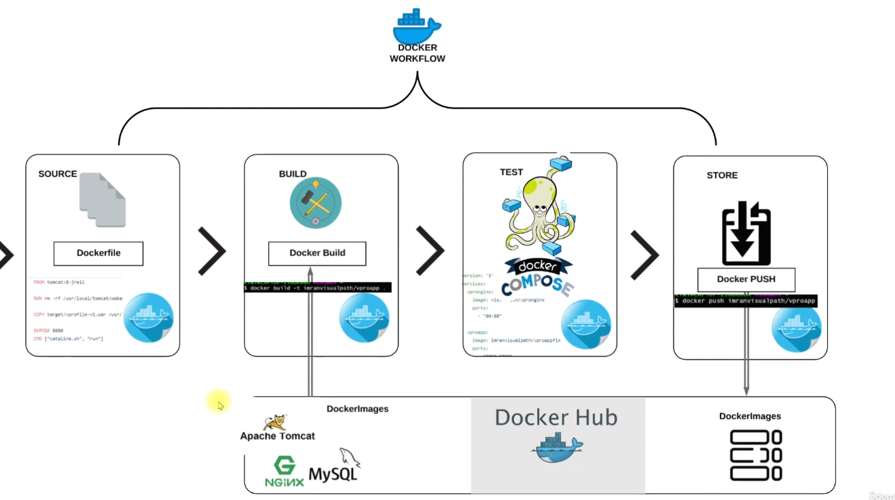

# Miroservices Approch - Docker compose

Deploy the application on the docker on a single host instance using docker compose

## Architecture


## Steps to Deploy
1. **Clone the repository**:
   ```bash
   git clone https://github.com/shreyash99ramtekkar/devops_project_infra.git
   cd devops_project_infra/Docker-Compose - project3
    ```
2. **Build the images**:
    ```bash
    docker compose build
    ```
3. **Start the application**:
    ```bash
    docker compose up -d
    ```
4. **Shut down the application**:
    ```bash
    docker compose down -v --rmi all
    ```


## Credits
Application Credit: [Vprofile](https://github.com/hkhcoder/vprofile-project.git)