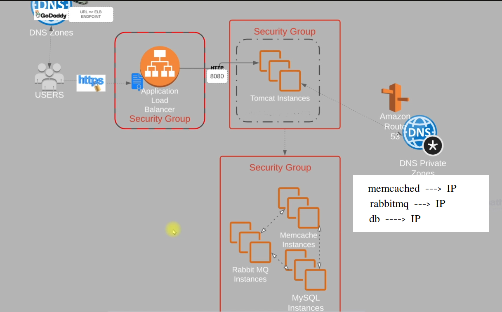

# Lift and Shift Application to AWS

In this project, we will demonstrate how to lift and shift an application to AWS using the Terraform, Ansible. The application is a simple web application that runs on a virtual machine on ec2 free tier. 

## Architecture


## Prerequisites
- [Setup Project](../project0/README.md)

## Project Structure
```
.
├── ansible
│   ├── files
│   |     └── application.properties
│   ├     └── vprofile-v2.war
│   ├── inventory
│   └── playbook.yml
├── terraform
│   ├── main.tf
│   ├── variables.tf
│   └── terraform.tf
└── README.md
```

## Steps to Deploy
1. **Clone the repository**:
   ```bash
   git clone https://github.com/shreyash99ramtekkar/devops_project_infra.git
   cd devops_project_infra/project1/terraform
    ```
2. **Configure AWS credentials**:
    Ensure your AWS credentials are configured. You can set them up using the [AWS CLI](https://docs.aws.amazon.com/cli/v1/userguide/cli-configure-files.html#cli-configure-files-methods)
    ```bash
    aws configure
    ```
3. **Initialize Terraform**:
    ```bash
    terraform init
    ```
4. **Plan the Terraform deployment**:
    ```bash
    terraform plan
    ```
5. **Apply the Terraform configuration**:
    ```bash
    terraform apply
    ```

6. **Run Ansible playbook**:
    Navigate to the Ansible directory and run the playbook:
    ```bash
    # Copy the Public ip of tomcat from the output in the inventory File and change the inventory variables( pem file location) accordingly
    cd ../ansible
    ansible-playbook -i inventory playbook.yml
    ```
    
7. **Add the LB DNS Record in Domain DNS**:
    Please change the domain [configured](../project0/README.md)

    CName: vprofile.devops-projects.tech

    CValue: load-balancer-url


8. **Verify the login**
    https://vprofile.devops-projects.tech
      


## Credits
Application Credit: [Vprofile](https://github.com/hkhcoder/vprofile-project.git)