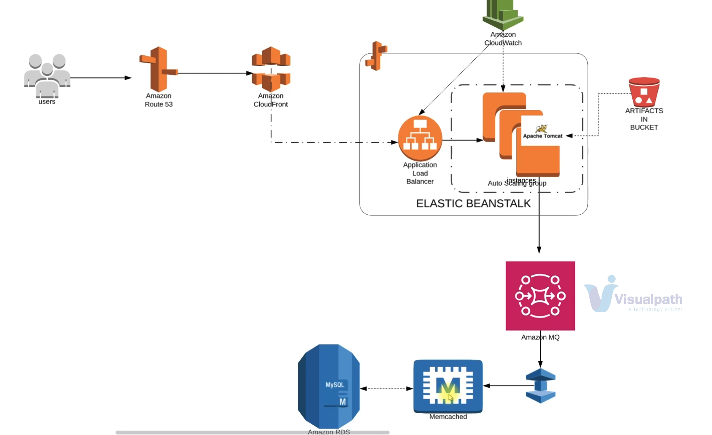

# Refactor Application to AWS - Cloud Native Services

Refactor EC2-based deployment to AWS Elastic Beanstalk and managed services using Terraform and Ansible.


## Architecture



## Prerequisites
Please create the certificate in us-east-1 (For Cloudfront) as well as the desired region you want to create infrastructure for your application
- [Setup Project](../project0/README.md)

## Project Structure
```
.
├── ansible
│   ├── files
│   ├── inventory
│   └── main.yml
├── terraform
│   ├── main.tf
│   ├── variables.tf
│   └── terraform.tf
|   └── output.tf
└── README.md
```

## Steps to Deploy
1. **Clone the repository**:
   ```bash
   git clone https://github.com/shreyash99ramtekkar/devops_project_infra.git
   cd devops_project_infra/project2/terraform
   #Change the required variable values
   vim variable.tf
    ```
2. **Configure AWS credentials**:
    Ensure your AWS credentials are configured. You can set them up using the [AWS CLI](https://docs.aws.amazon.com/cli/v1/userguide/cli-configure-files.html#cli-configure-files-methods)
    ```bash
    aws configure
    ```
3. **Initialize Terraform**:
    ```bash
    terraform init
    ```
4. **Plan the Terraform deployment**:
    ```bash
    terraform plan
    ```
5. **Apply the Terraform configuration**:
    ```bash
    terraform apply
    ```

6. **Run Ansible playbook**:

    -  Navigate to the Ansible directory and run the playbook:
    ```
        cd ../ansible
    ```
    - Change the inventory variable and inventory host
    ```
        vim inventory
        # Add the ip address of the bastion host and chage the path of pem file
    ```
    - Update the Variables
    ```bash
    # Create a encrypted string for mysql password using ansible-vault
    ansible-vault encrypt_string 'PassW0rd' --name 'db_pass'
    # copy the output in the vars section of the main.yaml or create a seperate vars file and import it in the main file
    # Change the variable values. Copy the variables output from terraform
      mysql_rds_address: "rds-mysql-eu-west-1-prod-web-app.com"
      rabbitmq_address: "b-d7358a7c-17ae-4626-a013-5367100e52a3.mq.com"
      memcached_address: "memcached-cluster.com"
    ```
    
    - Run the playbbok
    ```bash
    ansible-playbook -i inventory playbook.yml --ask-vault-pass
    ```
    
7. **Add the Cloudfront DNS Record in Domain DNS**:
    Please change the domain [configured](../project0/README.md)

    CName: vprofile.devops-projects.tech

    CValue: cloudfront dns


8. **Verify the login**
    https://vprofile.devops-projects.tech
      


## Credits
Application Credit: [Vprofile](https://github.com/hkhcoder/vprofile-project.git)